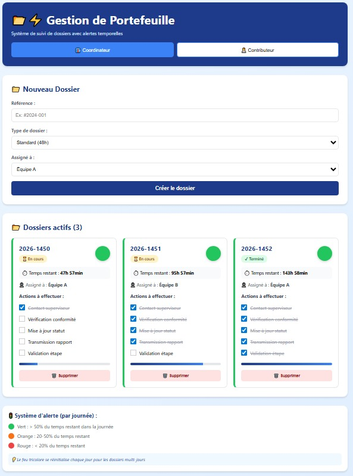
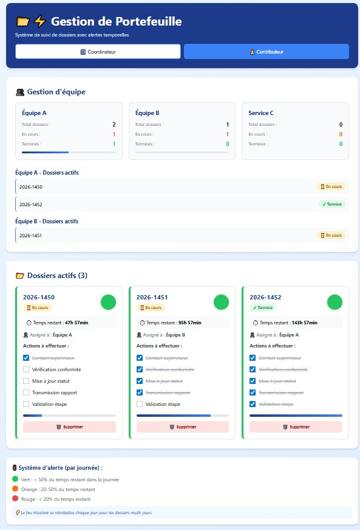

# 📂⚡ Gestion de Portefeuille - Portfolio Management

## Preview

**Coordinator View**



**Contributor View - Team Statistics**



## Description

A full-featured **Portfolio Management App** built with **React + Vite**, demonstrating:

- Complex state management with **useReducer + Context API**
- Real-time urgency calculation with **traffic light system** 🚦
- Dynamic timers updating every minute
- Workflow management with **daily recurring tasks**
- Role-based views (**Coordinator** / **Contributor**)
- Team statistics and progress tracking

This project transposes a real-world need from public administration into a generic portfolio tracking tool, showing practical React skills across state management, business logic, and component architecture.

🔗 **[Live Demo](https://gestion-portefeuille-teal.vercel.app/)**

---

## Features

- **Traffic light urgency system**: Visual alerts (🟢 green / 🟠 orange / 🔴 red / ⚫ expired) based on remaining time
- **4 file types**: Express (24h), Standard (48h), Extended (96h), Exceptional (144h)
- **Daily task cycles**: Urgency resets every 24h for multi-day files
- **Coordinator mode**: Create files, assign to teams, track progress
- **Contributor mode**: Team statistics, progress bars, active file lists
- **Real-time countdown**: Hours and minutes updated automatically
- **Auto status calculation**: Pending → In Progress → Completed based on checked actions

---

## Tech Stack

- React 19
- Vite 8.0
- Hooks: `useState`, `useEffect`, `useContext`, `useReducer`, `useCallback`
- Context API for global state
- Plain CSS with Navy/Blue marine theme
- Deployed on Vercel

---

## Folder Structure

```
src/
├── components/
│   ├── DossierForm.jsx         # File creation form
│   ├── DossierCard.jsx         # Card with traffic light + timer
│   ├── DossierList.jsx         # List sorted by urgency
│   └── GestionEquipe.jsx       # Team statistics view
├── context/
│   └── DossierContext.jsx      # Context + useReducer logic
├── styles/
│   └── App.css
└── App.jsx
```

---

## How to Run

1. Clone the repository:

```bash
git clone https://github.com/atteewf/gestion-portefeuille.git
```

2. Install dependencies:

```bash
npm install
```

3. Start the development server:

```bash
npm run dev
```

Open http://localhost:5173 in your browser.

---

## Business Logic

The application implements several business rules:

**File status** is calculated automatically:

- **Pending**: No actions completed
- **In Progress**: At least one action completed
- **Completed**: All actions completed

**Urgency level** is calculated based on remaining time in the current day:

- 🟢 **Green**: > 50% of time left
- 🟠 **Orange**: 20–50% of time left
- 🔴 **Red**: < 20% of time left
- ⚫ **Expired**: Deadline passed

**Files are sorted automatically** by urgency (red first) and deadline.

---

## Architecture Decisions

### Why useReducer?

Initially built with `useState`, the app grew to include:

- Multiple action types (add file, toggle action, update assignment, delete)
- Automatic status calculation based on checked actions
- Complex state with nested objects (files → actions)

**useReducer centralizes all business logic** in one place, making the code more maintainable and testable.

### Why daily cycles?

In the original use case (public administration), certain legal procedures require **daily repetition of actions** (e.g., rights notification, supervisor contact). The traffic light resets every 24h to reflect this workflow.

---

## Project Origin

This project was inspired by my experience in public administration, where I managed files with **strict legal deadlines**. The challenge: no visual alert system to prevent deadline overruns.

I transposed this need into a generic portfolio management tool, demonstrating my ability to:

- Analyze a real business problem
- Design a technical solution
- Implement complex React patterns

---

## Future Improvements

- [ ] Push notifications before deadlines
- [ ] Data persistence (LocalStorage or backend API)
- [ ] Advanced filters (status, team, urgency)
- [ ] PDF export for reports
- [ ] Dashboard with charts (deadline compliance rate)
- [ ] Dark mode

---

## Author

**Seb Ollivier** – Frontend Developer in Career Transition

GitHub: [@atteewf](https://github.com/atteewf)

---

## Contact

LinkedIn: https://www.linkedin.com/in/seb-o-0188133a4/  
Email: ateeew@gmail.com
